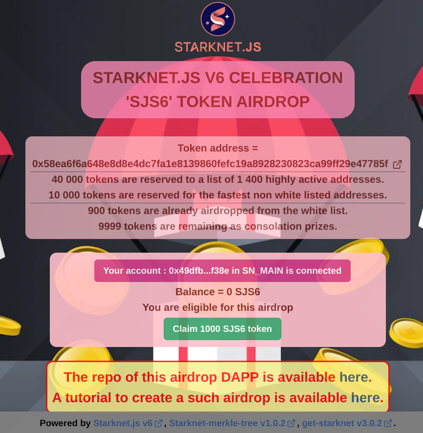

<h1 style="text-align: center;"> Airdrop for Starknet </h1>

<p align="center">
  
</p>

**This DAPP has not been audited ; use at your own risks.**

> **Stars are highly appreciated! Thanks in advance.**

This repo contains a demo DAPP performing an airdrop in the Starknet network.  

you can launch this DAPP [here](https://airdrop-for-starknet.vercel.app/).
It can be used as boiler plate to create your own airdrop.

## Tutorial :
A tutorial to create an airdrop DAPP from scratch is available [here](./airdrop-tuto.md)

## Libraries :
This DAPP is using the most famous Starknet libs :
- [Starknet.js](https://www.starknetjs.com)
- [Starknet-merkle-tree](https://github.com/PhilippeR26/starknetMerkleTree)
- [Get-starknet](https://github.com/starknet-io/get-starknet)

and also :
- Next.js for the DAPP framework
- Chakra-ui for th UI
- Zustand for the context handling
- Vercel for the deployment

## Testing the DAPP :

First, run the development server:
```bash
npm run dev
```

Open [http://localhost:3000](http://localhost:3000) with your browser to see the result.

You can start editing the page by modifying `app/page.tsx`. The page auto-updates as you edit the file.

The easiest way to deploy your airdrop app is to use the [Vercel Platform](https://vercel.com/new?utm_medium=default-template&filter=next.js&utm_source=create-next-app&utm_campaign=create-next-app-readme) from the creators of Next.js.  
Check out the [Next.js deployment documentation](https://nextjs.org/docs/deployment) for more details.
