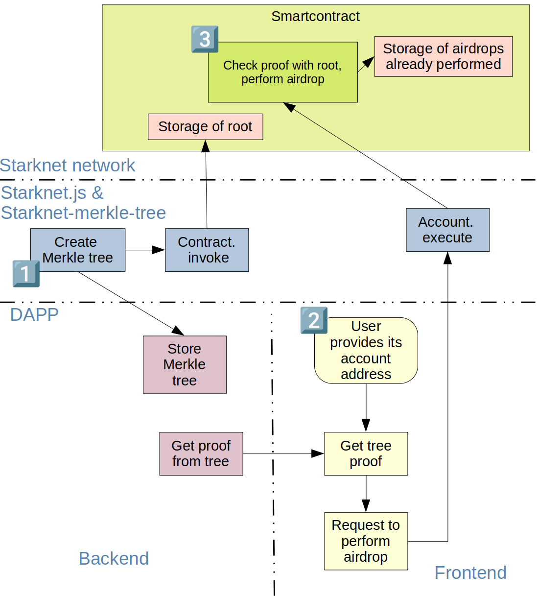
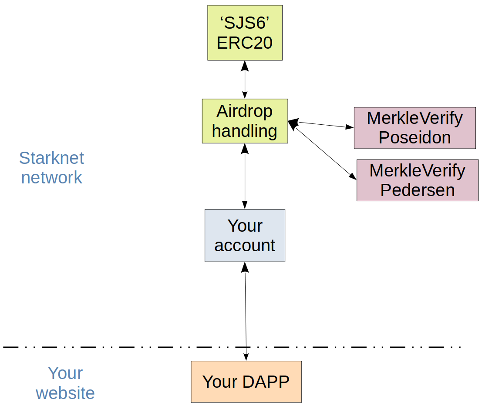

# TUTORIAL
# Create your own airdrop

## Architecture :



## Smart-contracts :



# 1. Creation/storage of the merkle tree and the smart-contracts :
A Merkle tree is very useful for an airdrop : you will store very few data in the blockchain, you will ask few calculation to starknet, and the frontend needs nearly zero resources. We need just storage space in the server.

## creation of the Merkle tree :

Most of the time, you start your airdrop project with an Excel file including all the inputs : [data sheet example](./listAirdrop/). In this example, we have about 1400 whitelisted addresses.

You have to transform these data to a json file. I made it with the find/replace capabilities of vsCode. The result is a `list` array. It includes small arrays containing :
- address
- quantity u256.low
- quantity u256.high
  
These arrays are called the **leaves** of the Merkle tree.  
I added 3 of my personal accounts, to be able to perform some tests.  
The result is [here](scripts-ts-node/listAddressesGoerli.json) .

Several TS codes will now be used, using the Goerli Testnet.  
> All these scripts can be read [here](./scripts-ts-node), and you can run them directly in my tuto repo [here](https://github.com/PhilippeR26/starknet.js-workshop-typescript/tree/main/src/scripts/merkleTree/airdropSJS6Goerli).

The script is using the [starknet-merkle-tree](https://www.npmjs.com/package/starknet-merkle-tree) library.
The tree can be hashed with Pedersen or Poseidon algorithms 
```typescript
import * as Merkle from "starknet-merkle-tree";

const list = json.parse(fs.readFileSync("./src/scripts/merkleTree/airdropSJS6Goerli/listAddressesGoerli.json").toString("ascii"));
const airdrop: Merkle.InputForMerkle[] = list.list;
const tree1 = Merkle.StarknetMerkleTree.create(airdrop, Merkle.HashType.Poseidon);
console.log("root =", tree1.root); // for smartcontract constructor
fs.writeFileSync('./src/scripts/merkleTree/airdropSJS6Goerli/treeListAddressGoerli.json', JSON.stringify(tree1.dump(),undefined,2));
```
After some seconds of hard calculation (50 minutes on my laptop for 500 000 leaves, 5 seconds for this tuto), the tree is completed and is stored in the hard disk. This calculation is needed only once ; from now, we will only read the tree file.

## storage of the Merkle tree file :
This big file has to be stored somewhere in the server, and it will be used only by the server (as it's a large file, it has to be never downloaded by the frontend).  
In this DAPP, the resulting tree is  stored in the server [here](src/app/tree/treeListAddressGoerli.json).

## Deployment of Merkle-Verify contract :
As we have now the root value of the tree, we can deploy in Testnet an instance of the contract that verify the validity of a leaf.
We have the class hash for the poseidon version in the doc of starknet-merkle-tree [here](https://github.com/PhilippeR26/starknetMerkleTree#-verify-a-proof-in-the-starknet-blockchain-).  
This class is already declared in all networks. We have just to deploy it with a constructor including the root of the tree :
```typescript
const MERKLE_CLASS_HASH_POSEIDON = "0x03e2efc98f902c0b33eee6c3daa97b941912bcab61b6162884380c682e594eaf";
//    👇👇👇 change here with the result of script 1
const root = "0x194e675741d7c524534b48d1813ae10d036f4fb2f4e6077d1809fbb9d6d79f4"
const myConstructorMerkleVerify: Calldata = CallData.compile([root]);
console.log("In progress...");
const deployResponse = await account0.deployContract({
    //         👇👇👇 change here to PEDERSEN or POSEIDON
    classHash: MERKLE_CLASS_HASH_POSEIDON,
    constructorCalldata: myConstructorMerkleVerify
});
const MerkleVerifyAddress = deployResponse.contract_address;
console.log("MerkleVerify contract :");
console.log("address =", MerkleVerifyAddress);
```

## Declare/deploy the ERC20 token of the airdrop :
You can find in script 3 the details for the deployment of the SJS6 ERC20 token.

## Declare/deploy the airdrop management contract :
In this example, there is an airdrop for a whitelist, and a limited quantity of tokens sent as consolation prize for the fastest other users. All this logical is coded in the airdrop management contract.  
The Cairo code created for this tuto is [here](scripts-ts-node/airdropSJS6.cairo). You have to adapt it to your specific case.  
Deployment :
```typescript
const myCallAirdrop = new CallData(compiledSierraAirdrop.abi);
    const myConstructorAirdrop: Calldata = myCallAirdrop.compile("constructor", {
        erc20_address: ERC20_ADDRESS,
        merkle_address: MERKLE_VERIF_ADDRESS,
        erc20_owner: account0.address,
        start_time: 0, // no date of airdrop start
        consolation_remaining: 10_000,
    });
    const deployResponse = await account0.declareAndDeploy({
        contract: compiledSierraAirdrop,
        casm: compiledCasmAirdrop,
        constructorCalldata: myConstructorAirdrop
    });

    const airdropAddress = deployResponse.deploy.contract_address;
    const airdropClassHash = deployResponse.declare.class_hash;
    console.log("Airdrop contract :");
    console.log("class_hash =", airdropClassHash);
    console.log("address =", airdropAddress);
```
Script 4 is also authorizing the airdrop contract to spent the tokens of the ERC20 contract.

In this chapter, we have create the Merkle tree, and all the necessary contracts. Let see now inside the DAPP.

# 2. Handling of the airdrop in the DAPP :
In the DAPP, all the specific constants necessary for the airdrop are in `utils/constants`, [here](src/app/utils/constants.ts).

# 3. Execution of the airdrop in Starknet :


